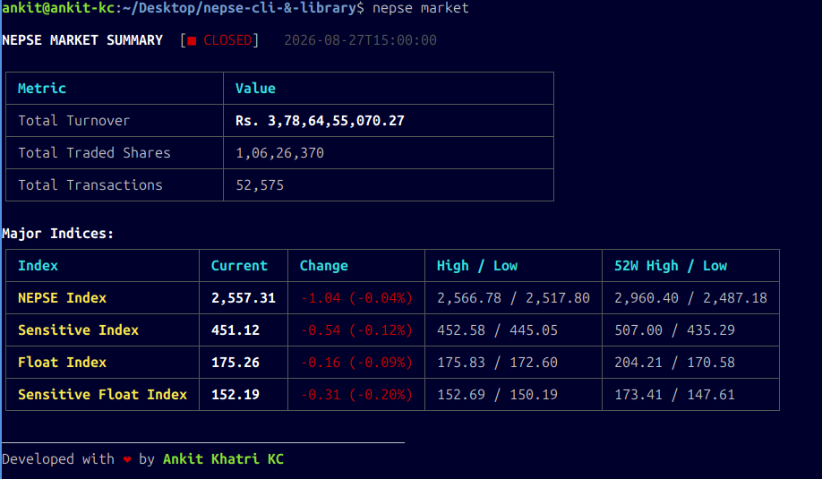
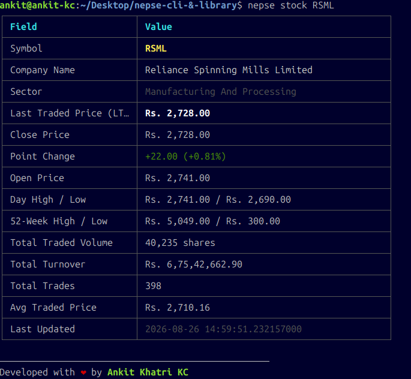
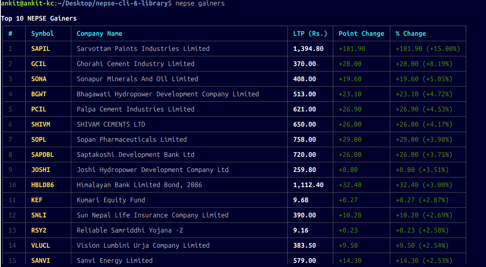
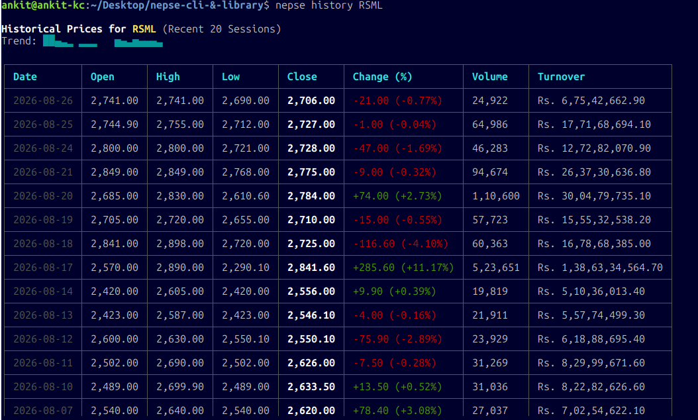

# nepsehub

[](https://www.npmjs.com/package/nepsehub)
[](https://opensource.org/licenses/MIT)
[](https://www.typescriptlang.org/)

A TypeScript library and command-line tool (CLI) for accessing **real-time and historical Nepal Stock Exchange (NEPSE)** market data directly from official exchange endpoints.

---

## Screenshots

| Live Stock Quote | NEPSE Market Summary |
|:---:|:---:|
|  |  |

| Stock Historical Trend | Top Gainers |
|:---:|:---:|
|  |  |

---

## Quick Start

### Use with `npx` (No installation required)

```bash
# Get live quote for Nabil Bank
npx nepsehub stock NABIL

# View NEPSE market summary and indices
npx nepsehub market

# View top gainers of the session
npx nepsehub gainers
```

### Install Globally as CLI

```bash
npm install -g nepsehub
```

Executable name `nepsehub` is now available globally:

```bash
nepsehub stock NABIL
nepsehub market
nepsehub gainers
nepsehub losers
nepsehub active
nepsehub history NABIL --limit 10
nepsehub search "Bank"
```

### Install as Library in your Project

```bash
npm install nepsehub
# or
pnpm add nepsehub
# or
yarn add nepsehub
```

---

## Library API Reference

### 1. `getQuote(symbol: string)`

Fetches the latest trading metrics for a given stock ticker symbol.

```typescript
import { getQuote } from 'nepsehub';

async function main() {
  const quote = await getQuote('NABIL');
  console.log(quote);
}

main();
```

**Response (`StockQuote`):**
```json
{
  "symbol": "NABIL",
  "securityId": 131,
  "companyName": "Nabil Bank Limited",
  "sector": "Commercial Banks",
  "lastTradedPrice": 545,
  "closePrice": 545,
  "openPrice": 550,
  "highPrice": 552,
  "lowPrice": 544.2,
  "previousClose": 548.5,
  "pointChange": -3.5,
  "percentageChange": -0.64,
  "totalTradedQuantity": 38251,
  "totalTradedValue": 20904592.3,
  "totalTrades": 416,
  "fiftyTwoWeekHigh": 568,
  "fiftyTwoWeekLow": 471,
  "averageTradedPrice": 546.51,
  "lastUpdatedTime": "2026-08-21 14:59:58.028540000",
  "activeStatus": "A"
}
```

---

### 2. `getMarketSummary()`

Fetches the overall NEPSE market turnover, volume, transactions, and major index values.

```typescript
import { getMarketSummary } from 'nepsehub';

const summary = await getMarketSummary();
console.log(`NEPSE Index: ${summary.indices.nepse.currentValue} (${summary.indices.nepse.percentageChange}%)`);
console.log(`Total Turnover: Rs. ${summary.totalTurnoverRs.toLocaleString('en-IN')}`);
```

---

### 3. `getHistory(symbol: string, options?: HistoryOptions)`

Retrieves historical OHLCV price records for a stock.

```typescript
import { getHistory } from 'nepsehub';

// Get last 15 trading days
const history = await getHistory('NABIL', { limit: 15 });

history.forEach((h) => {
  console.log(`${h.date} | Close: ${h.close} | Vol: ${h.volume}`);
});
```

---

### 4. `searchStocks(query: string)`

Searches actively listed NEPSE companies by ticker symbol or full company name.

```typescript
import { searchStocks } from 'nepsehub';

const banks = await searchStocks('Bank');
console.log(`Found ${banks.length} bank securities.`);
```

---

### 5. Top Movers (`getTopGainers`, `getTopLosers`, `getMostActive`)

```typescript
import { getTopGainers, getTopLosers, getMostActive } from 'nepsehub';

const [gainers, losers, active] = await Promise.all([
  getTopGainers(),
  getTopLosers(),
  getMostActive(),
]);
```

---

## CLI Commands & Options

### `nepsehub -V, --version`

Check the currently installed version of nepsehub.

```bash
nepsehub -V
```

### `nepsehub stock <symbol>`

Get real-time quote for a stock.

```bash
nepsehub stock NABIL
nepsehub stock SHIVM --json
nepsehub stock NABIL --watch --interval 3000
```

### `nepsehub market`

Get market overview, indices, total turnover and status.

```bash
nepsehub market
nepsehub market --json
```

### `nepsehub history <symbol>`

Get historical OHLCV data with trend sparkline.

```bash
nepsehub history NABIL --limit 30
nepsehub history GBIME --json
```

### `nepsehub search <query>`

Search stocks by symbol or company name.

```bash
nepsehub search Microfinance
nepsehub search Hydro
```

### `nepsehub gainers` & `nepsehub losers`

List top 10 price gainers / losers of the day.

```bash
nepsehub gainers
nepsehub losers
```

### `nepsehub active`

List top 10 most active stocks by trading turnover.

```bash
nepsehub active
```

---

## Testing & Development

Run unit test suite with Vitest:

```bash
npm test
```

Build library and CLI distribution bundles:

```bash
npm run build
```

---

## License

MIT License. Copyright (c) 2026.
